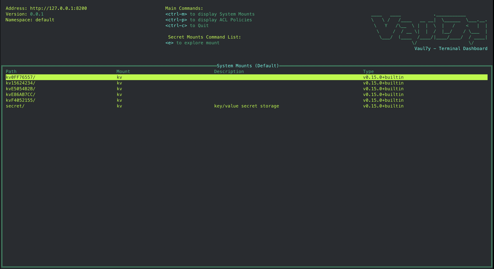

# Usage 

## Setup
### Installation

### Brew

```shell
brew install dkyanakiev/tap/vaul7y
```
to upgrade
```shell
brew update && brew upgrade vaul7y
```

### Download from GitHub

Download the relevant binary for your operating system (macOS = Darwin) from
the [latest Github release](https://github.com/dkyanakiev/vaul7y/releases). Unpack it, then move the binary to
somewhere accessible in your `PATH`, e.g. `mv ./vaul7y /usr/local/bin`.

### > Using [go installed on your machine](https://go.dev/doc/install)

```shell
go install github.com/dkyanakiev/vaul7y@latest
```

### Building from source and Run Vaul7y

Make sure you have your go environment setup:

1. Clone the project
1. Run `$ make build` to build the binary
1. Run `$ make run` to run the binary
1. You can use `$ make install-osx` on a Mac to cp the binary to `/usr/local/bin/vaul7y`

or

```
$ go install ./cmd/vaul7y
```

### How to use it

Once `Vaul7y` is installed and avialable in your path, simply run:

```
$ vaul7y
```




### Environment variables

In order to use the tool you must expose the needed env variables, that would generally be used by the vault cli to auth to a given cluster. 

Required:  
`VAULT_ADDR`  
`VAULT_TOKEN`

For the full list see the [official docs](https://developer.hashicorp.com/vault/docs/commands#environment-variables)

Another option is to store your configs in yaml file named `.vaul7y.yaml` stored in your home directory.  
Example: [`~/myuser/.vaul7y.yaml`](./examples/vaul7y.yaml)

Or alternatively pass a config file as an argument using `-c <path/file.yaml>`  
Example: `vaul7y -c ./new-env.yml`

#### Authentication and variables priority
Variables will be loaded in the following order, with the next superseding the previous ones:

1. Will check for vault [token cache](https://developer.hashicorp.com/vault/docs/commands#authenticating-to-vault)
2. Read from env variables
3. Config file 

### Features

#### Navigation

| Key | Action |
|-----|--------|
| `ctrl-b` | Secret Engines (KV mounts) |
| `ctrl-p` | ACL Policies |
| `ctrl-t` | Namespaces (Enterprise) |
| `ctrl-a` | Auth Methods |
| `ctrl-c` | Quit |

#### Secret Engines / KV Secrets

* Browse KV v1 and v2 mounts
* Filter paths and secrets with `/`
* Jump directly to a path with `J`
* Create new secrets with `ctrl-n` — choose JSON editor or Key-Value form

#### Secret Object view

| Key | Action |
|-----|--------|
| `h` | Toggle show/hide secret values |
| `c` | Copy selected value to clipboard |
| `j` (JSON view) | Toggle JSON view |
| `t` | Toggle metadata panel (KV v2 only) |
| `P` | Patch secret — choose JSON editor or Key-Value form |
| `U` | Update (full replace) secret — choose JSON editor or Key-Value form |
| `D` | Soft-delete current version (KV v2) |
| `R` | Rollback to a previous version (KV v2) |
| `X` | Permanently destroy a specific version (KV v2) |
| `M` | Edit secret metadata — max_versions, cas_required, delete_version_after (KV v2) |
| `b` / `esc` | Go back |

When creating or updating via the Key-Value form, use **Add Key** to add multiple key-value pairs. Pairs with a blank key are ignored on save.

#### ACL Policies

* Browse and filter policies
* `i` / `Enter` — inspect policy content
* In policy view: `E` to edit, `ctrl-w` to save, `esc` to cancel
* `c` — copy policy to clipboard
* `w` — toggle word wrap
* Vim-style reading navigation: `j`/`k` (line), `d`/`u` (half-page), `g`/`G` (top/bottom)

#### Auth Methods

* `ctrl-a` from any view — lists all enabled auth methods with their mount path, type, and description

#### Header info bar

At startup vaul7y fetches and displays:
* Vault address and version
* Seal status and cluster name
* Token TTL and attached policies

#### Namespace support (Enterprise)

* `ctrl-t` — switch between namespaces
* `ctrl-d` — return to default namespace
* `ctrl-w` — return to root namespace
