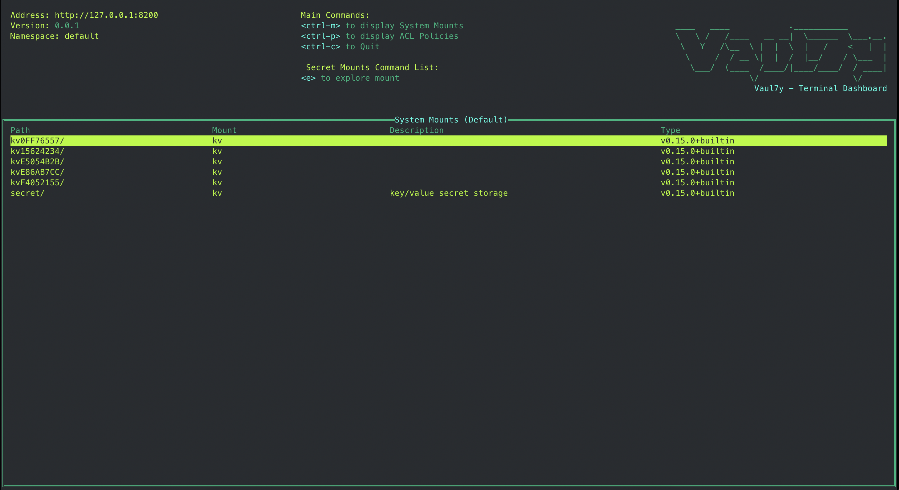

# Usage 

## Setup
### Installation

### Brew

--> Not currently supported

### Building from source and Run Vaul7y

Make sure you have your go environment setup:

1. Clone the project
1. Run `$ make build` to build the binary
1. Run `$ make run` to run the binary
1. You can use `$ make install-osx` on a Mac to cp the binary to `/usr/local/bin/vaul7y`

or

```
$ go install ./cmd/vaul7y
```

### How to use it

Once `Vaul7y` is installed and avialable in your path, simply run:

```
$ vaul7y
```




### Environment variables

In order to use the tool you must expose the needed env variables, that would generally be used by the vault cli to auth to a given cluster. 

Required:  
`VAULT_ADDR`  
`VAULT_TOKEN`

For the full list see the [official docs](https://developer.hashicorp.com/vault/docs/commands#environment-variables)


### Features

Currently the capabilities are limited. 

* Support for navigation between KV mounts
    * Currently only KV2
* Looking up secret objects
    * Show/hide secrets and coping data
    * Update/patch coming soon
* Support for exploring and filtering ACL Policies

*Note*: Currently only supporting default namespace. Will implement the namespace change fairly soon.